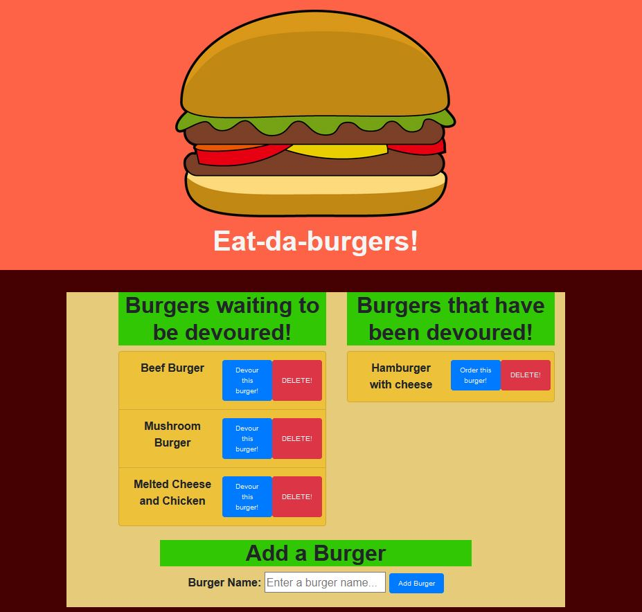

# Eat a burger!

##### You can have the burger, and you can eat it too!

## Description

This burger eating app was designed with a MySQL database connection in mind. It utilises CRUD functionality and an orm system to manage the functionality. You can add whatever burger (or other food if you like) to the list to be devoured by you later.

This is just a fun way to test the use of orm, and to persist data using MySQL. It has been hosted on Heroku and utilises a connection with JAWSDB as a cloud based database fill-in.

## Contents

- [Installation](#installation)
- [Usage](#usage)
- [User Story](#user-story)
- [Demonstration](#demonstration)
- [Screenshots](#screenshots)
- [Questions](<#questions-(FAQ)>)
- [Contact](#contact)
- [Author](#authors)
- [Acknowledgements](#acknowledgements)

## Installation

1. Clone the GitHub repository

```
git clone https://github.com/AGr2020Xman/Eat-a-burger.git
```

2. Install all dependent npm packages

```
npm install --save
```

3. Update the config/connection.js file with updated MySQL connection paramets for a local connection.

## Usage

Run <addr>npm start</addr> and use your browser to open [http://localhost:7001](http://localhost:7001).

## User Story

```
AS A foodie,
I WANT TO record burgers I want to eat,
SO THAT I can gamify the consumption of them!

```

## Demonstration

- [Deployed application on heroku](https://thawing-gorge-00712.herokuapp.com/)

## Screenshots

_The burger themed food eating app_

- 

_You can eat, reorder and delete burgers_

- 

_You can also add new burgers to your list!_

- 

## Questions

- Submit questions to my contact details below.

## Contact

- Contact me with any questions on my email: agre.fun21@gmail.com or silver.grech@gmail.com

## Author

- Initial files to develop by Trilogy Education Services
- Andr&eacute; Grech - 16/11/2020

### Acknowledgements

- © 2019 Trilogy Education Services, a 2U, Inc. brand. All Rights Reserved.
